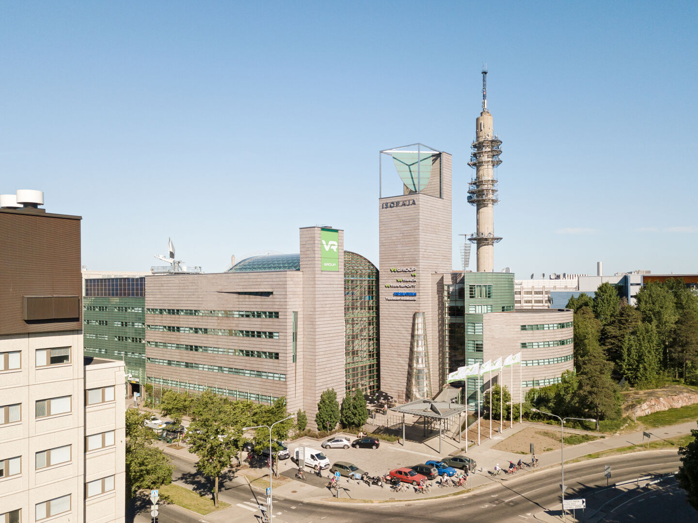

The worldwide community is meeting in September in Helsinki, Finland to discuss all kinds of topics around OTP 
 and, of course, to socialise. 

It is aimed at OTP users and interested parties at all levels of knowledge and expertise.

The event is free.

<a href="https://docs.google.com/forms/d/e/1FAIpQLSdR363ujobEKi5g_cP96r6X4UVhGy2J7pyir5dbX-u9eQCJRg/viewform?usp=dialog" target="_blank">
 <button >Register</button>
</a>

## Schedule

The full schedule is available on our [Github board](https://github.com/orgs/opentripplanner/projects/4/views/1).

### Monday and Tuesday: product owners, decision makers, developers

On Monday, 15th and Tuesday, 16th of September we will hold a mix of talks and networking events that 
are broad in scope and aimed at product owners, decision makers, developers and everyone interested
in OTP.

At those days we are at

VR Office ([OSM](https://www.openstreetmap.org/way/445089820), [Google Maps](https://maps.app.goo.gl/Chwx64ioQZSgRzG28), [HSL Journey Planner](https://reittiopas.hsl.fi/en/reitti/POS/Iso%20Paja%2C%20Radiokatu%205%2C%20Helsinki%3A%3A60.203383%2C24.924894/?arriveBy=true&time=1757916000))  
Radiokatu 3  
Helsinki

©VR Group

Arrival to the building is through the main entrance (located in the center of the picture above). On Monday morning, there will be name badges available near the reception on the first floor. The rooms we use are also on the first floor.

The talks will include the following topics

- Getting Started with OTP
- Multimodal Mobility & Routing
- Real-Time & Reliability
- Customization & Extensibility
- Frontend & UX
- Analytics & Planning

### Wednesday to Friday: developers

Wednesday to Friday will be a developer-focused working meeting. It will consist mostly of unorganized
work either alone or in small groups, but there also might be short organized workshops and/or presentations.
To get a lot of value out of it, you should be familiar with developing OTP itself. It will be at:

HSL Office ([OSM](https://www.openstreetmap.org/node/2136579378), [Google Maps](https://maps.app.goo.gl/32ER7zoCjRn56u1v7), [HSL Journey Planner](https://reittiopas.hsl.fi/en/reitti/POS/Opastinsilta%206A%2C%20Helsinki%3A%3A60.199146%2C24.940544?arriveBy=true&time=1758088800))  
Opastinsilta 6  
Helsinki

Arrival to the office is from Opastinsilta through the court yard. The entrance is on the corner shown in the image above. Ring a door bell to enter the building. The receiption and the room we use are on the 2nd floor.

## Register

Please register to attend by [filling out this form](https://docs.google.com/forms/d/e/1FAIpQLSdR363ujobEKi5g_cP96r6X4UVhGy2J7pyir5dbX-u9eQCJRg/viewform?usp=dialog)
as it helps us to plan the event better.

<b>Please register before 25th of August (registration will be available still after this deadline but
you might miss out on some social activity)</b>.

## Who will be there?

Everyone interested in OTP is welcome, and there will be a mix of experts and beginners. You can
expect both technical and product and community-oriented talks.

It will be a great opportunity to meet everyone involved in OTP.

## Contact

Should you have any questions, please email [brede.dammen@entur.org](mailto:brede.dammen@entur.org) or 
[mail@leonard.io](mailto:mail@leonard.io) or join the [Gitter chat](https://gitter.im/opentripplanner/OpenTripPlanner).

## Partners

