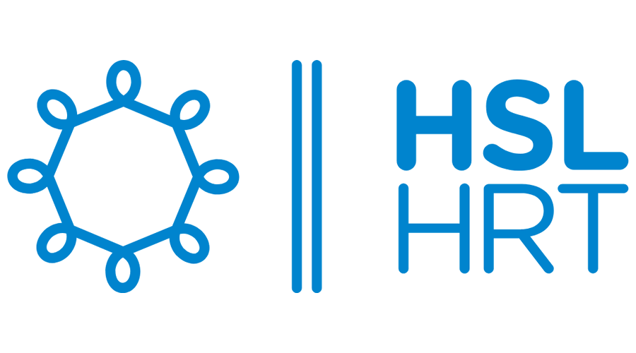

The worldwide community is meeting in September in Helsinki, Finland to discuss all kinds of topics around OTP 
 and, of course, to socialise. 

It is aimed at OTP users and interested parties at all levels of knowledge and expertise.

The event is free.

<a href="https://docs.google.com/forms/d/e/1FAIpQLSdR363ujobEKi5g_cP96r6X4UVhGy2J7pyir5dbX-u9eQCJRg/viewform?usp=dialog" target="_blank">
 <button >Register</button>
</a>

## Schedule

### Monday and Tuesday: product owners, decision makers, developers

On Monday, 15th and Tuesday, 16th of September we will hold a mix of talks and networking events that 
are broad in scope and aimed at product owners, decision makers, developers and everyone interested
in OTP.

The talks will include the following topics

- Getting Started with OTP
- Multimodal Mobility & Routing
- Real-Time & Reliability
- Customization & Extensibility
- Frontend & UX
- Analytics & Planning

A full schedule of talks will be published soon.

Monday and Tuesday will be held at

VR Offices ([OSM](https://www.openstreetmap.org/way/445089820), [Google Maps](https://maps.app.goo.gl/Chwx64ioQZSgRzG28))  
Radiokatu 3  
Helsinki

### Wednesday to Friday: developers

Wednesday to Friday will be a developer-focussed working meeting. To get a lot of value
out of it, you should be familiar with OTP development. It will be at:

HSL Helsinki ([OSM](https://www.openstreetmap.org/node/2136579378), [Google Maps](https://maps.app.goo.gl/32ER7zoCjRn56u1v7))  
Opastinsilta 6  
Helsinki 

## Register

Please register to attend by [filling out this form](https://docs.google.com/forms/d/e/1FAIpQLSdR363ujobEKi5g_cP96r6X4UVhGy2J7pyir5dbX-u9eQCJRg/viewform?usp=dialog)
as it helps us to plan the event better.

## Who will be there?

Everyone interested in OTP is welcome, and there will be a mix of experts and beginners. You can
expect both technical and product and community-oriented talks.

It will be a great opportunity to meet everyone involved in OTP.

## Partners

